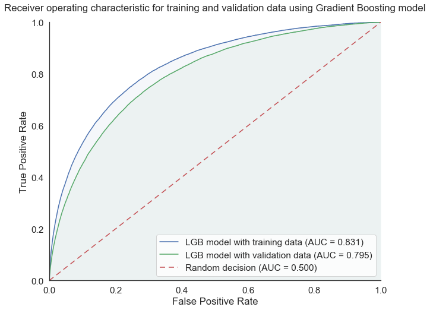

# Home Credit Default Risk

This project contains the Jupyter notebooks used for the [Home Credit Default Risk Kaggle competition](https://www.kaggle.com/c/home-credit-default-risk), in which the objective was to predict the probability of credit default for [Home Credit](http://www.homecredit.net/) customers in the database. Using a combination between a Gradient Boosting model and a Neural Network model, the final model ended up in the [top  9% in the Kaggle competition](https://www.kaggle.com/olivierbo/competitions), with a ROC AUC score of 0.795 on the private (hidden) test data.

## Introduction

The purpose of this Kaggle competition was to predict the probability of credit default for Home Credit customers using the available data (including new credit application data, past credit history obtained from a credit institution, past applications with Home Credit and past payments for previous credits with Home Credit). The metric used for the final score in this competition is the Area Under the [Receiver operating Characteristic Curve](https://en.wikipedia.org/wiki/Receiver_operating_characteristic) (ROC AUC).

## Feature Engineering

The available data consists in the following datasets:
* application: this dataset contains the main information about the customer, including the target (default or no default) for the training subset, but not for the test subset on which default probabilities are to be predicted,
* bureau and bureau_balance: these datasets contain the information on the customer provided by the credit rating institutions, including information on past credits and balance history,
* previous_application: this dataset contains the information regarding the previous credit applications at Home Credit by the customer,
* POS_CASH_balance, credit_card_balance, installment_payments: these datasets contain the information regarding payments for Home Credit loans and credit card by the customer.

The features in the main application dataset are used to create new features that may be more relevant to credit default risk than the existing features in this [notebook](https://github.com/Bougeant/Home_Credit_default_risk/blob/master/1%20-%20Application%20features.ipynb)), including:
* the ratio between the credit total and the annuity (indicative of total credit duration),
* debt to income ratio (indicative of the capacity to repay the loan),
* the average credit institution score (between the three sources of credit score),
* the estimated age at the end of the credit (from age and credit lenght),
* the personnal contribution (defined as the difference between the purchased goods and the credit).

In addition to the features contained in the application dataset, new features have been manually created from the other datasets. Indeed, because the dimension of the other datasets are very different from that of the application dataset (some datasets contain one row per month and per credit, some customers have multiple previous credits, etc.), there is a need for some feature engineering to convey the information contained in the other datasets for each application in the main dataset.

Here are some of the features that have been manually generated using the other datasets:
* the total number of days overdue on previous credits (from [bureau dataset features](https://github.com/Bougeant/Home_Credit_default_risk/blob/master/2%20-%20Bureau%20features.ipynb)),
* the fraction of months with late payments for past credits (from [bureau_balance dataset features](https://github.com/Bougeant/Home_Credit_default_risk/blob/master/3%20-%20Bureau_balance%20features.ipynb)),
* the fraction of months with payment lower than the minimum installment for credit cards with Home Credit (from [credit_card_balance dataset features](https://github.com/Bougeant/Home_Credit_default_risk/blob/master/4%20-%20Credit_card_balance%20features.ipynb)),
* the remaing number of installments on existing Home Credit loans (from [POS_CASH dataset](https://github.com/Bougeant/Home_Credit_default_risk/blob/master/5%20-%20Pos_cash_balance%20features.ipynb))
* the number of previously rejected applications with Home Credit (from [previous_application dataset](https://github.com/Bougeant/Home_Credit_default_risk/blob/master/6%20-%20Previous_application%20features.ipynb)),
* the average delay in installment payments (from [installments_payments dataset features](https://github.com/Bougeant/Home_Credit_default_risk/blob/master/7%20-%20Installments_payments%20features.ipynb)).

Furthermore, in order to extract as much information as possible from the other datasets, a [notebook](https://github.com/Bougeant/Home_Credit_default_risk/blob/master/8%20-%20Automatic%20features%20extraction.ipynb) is also used to automatically extract features from all auxilliary datasets, by calculating the average, minimum, maximum, sum and standard deviation of each feature for all the rows related to the customer. For categorical variables, dummy variables are created to allow this automatic feature extraction process. 

In total, 142 manually generated features and 880 automatically generated features are created from the other datasets, in addition to the 120 features already available in the application dataset (excluding ID and target columns).

Float numbers are converted to float32 to reduce memory usage and categorical variables are converted to binary one-hot variables. The application dataset with all its new features is then split back between the training and testing datasets. 

## Machine Learning Models and Main Results

For this type of supervized learning tasks, Gradient Boosting models (such as XGBoost and LightGBM) are known to outperform other types of models, including random forest and neural network problems. In the [machine learning notebook](https://github.com/Bougeant/Home_Credit_default_risk/blob/master/9%20-%20Machine%20learning%20model.ipynb), the [LightGBM (Light Gradient Boosting Machine)](https://lightgbm.readthedocs.io/en/latest/) algorithm is selected because it was found to be much faster than XGBoost for this task. Missing values are kept as such because LightGBM handles N/A values well.

This Gradient Boosting model was optimized using a self-made [Grid Search Cross-Validated algorithm](https://en.wikipedia.org/wiki/Hyperparameter_optimization#Grid_search), which takes into account early stopping (which is not possible with Scikit-Learn GridSearchCV function). After optimization this model obtains a cross-validated ROC AUC score of 0.795 for the training data, and 0.796/0.794 on the Kaggle public/private test data, with the private test data being only revealed at the end of the competition (August 29, 2018).

The graph below shows the ROC curve and the corresponding Area Under the Curve score for this optimized Gradient Boosting model, for both the training data and the validation data (using cross-validation on the training data). This graph shows that this model overfits a little bit because the ROC AUC is significantly better for the training data (0.831) than for the validation data(0.795), but we can trust that this is a good model because it lead to the best ROC AUC for the validation data and was confirmed by the very simlary score on the Kaggle public test data (0.796).

## How to use

The data (688MB) must be downloaded from this Kaggle [link](https://www.kaggle.com/c/9120/download-all) and moved to ./data in the working directory. 

The jupyter notebooks must be ran in the order in which they are numbered, from 1 to 9. The total execution time is about 24 hours (including about 80% for generating new fetures and 20% for training and running the models) on a reasonably good laptop.

At least 16 Gb of RAM is recommended to run this collection of notebooks and it is strongly recommended to close and halt each notebook before opening the next one in order to limit memory issues.

