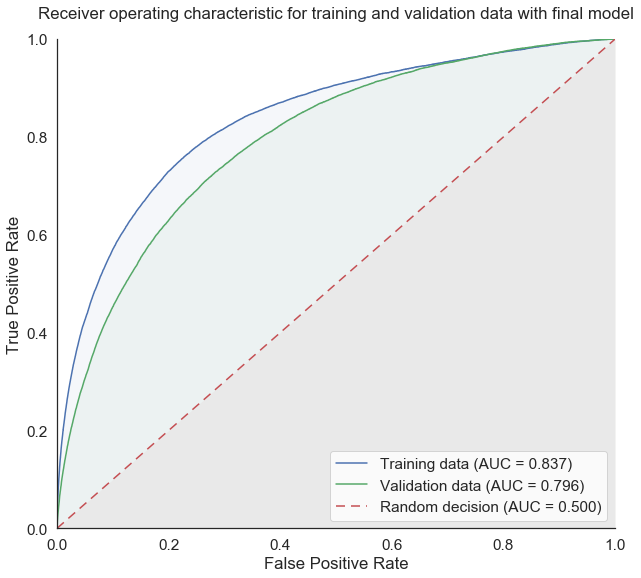
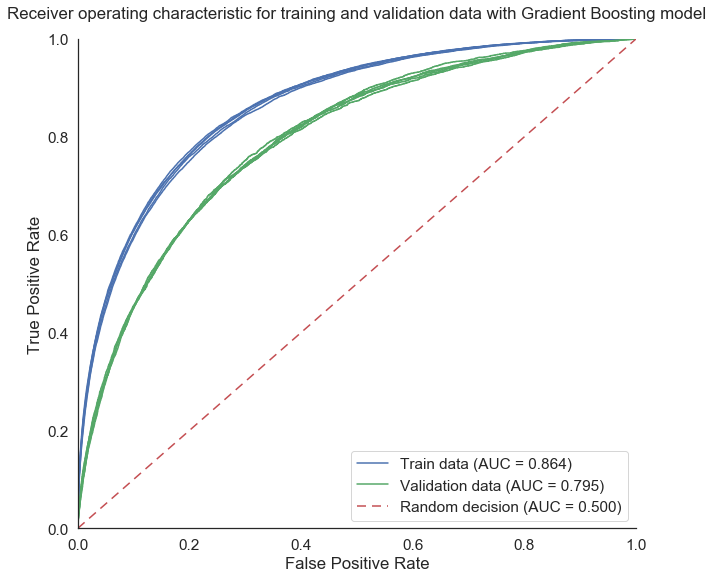

# Home Credit Default Risk

This project contains the Jupyter notebooks used for the [Home Credit Default Risk Kaggle competition](https://www.kaggle.com/c/home-credit-default-risk), in which the objective was to predict the probability of credit default for [Home Credit](http://www.homecredit.net/) customers in the database. Using a combination between a Gradient Boosting model and a Neural Network model, the final model ended up in the [top  9% in the Kaggle competition](https://www.kaggle.com/olivierbo/competitions), with a ROC AUC score of 0.795 on the hidden private test data (and a Cross-Validated ROC AUC score of 0.796 for the training data).

## Introduction

The purpose of this Kaggle competition was to predict the probability of credit default for Home Credit customers using the available data (including new credit application data, past credit history obtained from a credit institution, past applications with Home Credit and past payments for previous credits with Home Credit). The metric used for the final score in this competition is the Area Under the [Receiver operating Characteristic Curve](https://en.wikipedia.org/wiki/Receiver_operating_characteristic) (ROC AUC).

## Feature Engineering

The available data consists in the following datasets:
* application: this dataset contains the main information about the customer, including the target (default or no default) for the training subset, but not for the test subset on which default probabilities are to be predicted,
* bureau and bureau_balance: these datasets contain the information on the customer provided by the credit rating institutions, including information on past credits and balance history,
* previous_application: this dataset contains the information regarding the previous credit applications at Home Credit by the customer,
* POS_CASH_balance, credit_card_balance, installment_payments: these datasets contain the information regarding payments for Home Credit loans and credit card by the customer.

For example, the figure below shows the average default rate by education level (on the left side), as well as the distribution of customers by education level (on the right side).

The features in the main application dataset are used to create new features that may be more relevant to credit default risk than the existing features in this [notebook](https://github.com/Bougeant/Home_Credit_default_risk/blob/master/1%20-%20Application%20features.ipynb)), including:
* the ratio between the credit total and the annuity (indicative of total credit duration),
* debt to income ratio (indicative of the capacity to repay the loan),
* the average credit institution score (between the three sources of credit score),
* the estimated age at the end of the credit (from age and credit length),
* the personal contribution (defined as the difference between the purchased goods and the credit).

In addition to the features contained in the application dataset, new features have been manually created from the other datasets. Indeed, because the dimension of the other datasets are very different from that of the application dataset (some datasets contain one row per month and per credit, some customers have multiple previous credits, etc.), there is a need for some feature engineering to convey the information contained in the other datasets for each application in the main dataset.

Here are some of the features that have been manually generated using the other datasets:
* the total number of days overdue on previous credits (from [bureau dataset features](https://github.com/Bougeant/Home_Credit_default_risk/blob/master/2%20-%20Bureau%20features.ipynb)),
* the fraction of months with late payments for past credits (from [bureau_balance dataset features](https://github.com/Bougeant/Home_Credit_default_risk/blob/master/3%20-%20Bureau_balance%20features.ipynb)),
* the fraction of months with payment lower than the minimum installment for credit cards with Home Credit (from [credit_card_balance dataset features](https://github.com/Bougeant/Home_Credit_default_risk/blob/master/4%20-%20Credit_card_balance%20features.ipynb)),
* the remaining number of installments on existing Home Credit loans (from [POS_CASH dataset](https://github.com/Bougeant/Home_Credit_default_risk/blob/master/5%20-%20Pos_cash_balance%20features.ipynb))
* the number of previously rejected applications with Home Credit (from [previous_application dataset](https://github.com/Bougeant/Home_Credit_default_risk/blob/master/6%20-%20Previous_application%20features.ipynb)),
* the average delay in installment payments (from [installments_payments dataset features](https://github.com/Bougeant/Home_Credit_default_risk/blob/master/7%20-%20Installments_payments%20features.ipynb)).

Furthermore, in order to extract as much information as possible from the other datasets, a [notebook](https://github.com/Bougeant/Home_Credit_default_risk/blob/master/8%20-%20Automatic%20features%20extraction.ipynb) is also used to automatically extract features from all auxiliary datasets, by calculating the average, minimum, maximum, sum and standard deviation of each feature for all the rows related to the customer. For categorical variables, dummy variables are created to allow this automatic feature extraction process. 

In total, 142 manually generated features and 880 automatically generated features are created from the other datasets, in addition to the 120 features already available in the application dataset (excluding ID and target columns).

Float numbers are converted to float32 to reduce memory usage and categorical variables are converted to [binary one-hot variables](https://machinelearningmastery.com/why-one-hot-encode-data-in-machine-learning/). The application dataset with all its new features is then split back between the training and testing datasets. 

## Machine Learning Models and Main Results

### Gradient boosting model

For this type of supervised learning tasks, [Gradient Boosting](https://en.wikipedia.org/wiki/Gradient_boosting) models (such as XGBoost and LightGBM) are known to outperform other types of models, including random forest and neural network problems. In the [machine learning notebook](https://github.com/Bougeant/Home_Credit_default_risk/blob/master/9%20-%20Machine%20learning%20model.ipynb), the [LightGBM (Light Gradient Boosting Machine)](https://lightgbm.readthedocs.io/en/latest/) algorithm is selected because it was found to be much faster than XGBoost for this task. Missing values are kept as such because LightGBM handles N/A values well.

This Gradient Boosting model was optimized using a self-made [Grid Search Cross-Validated algorithm](https://en.wikipedia.org/wiki/Hyperparameter_optimization#Grid_search), which takes into account early stopping (which is not possible with [Scikit-Learn's GridSearchCV function](http://scikit-learn.org/stable/modules/generated/sklearn.model_selection.GridSearchCV.html)). It is made of decision trees with a maximum depth of 5, with each tree being built using 60% of features (to introduce diversity between the trees, as with a random forest model), and with both [L1 and L2 regularization](https://towardsdatascience.com/l1-and-l2-regularization-methods-ce25e7fc831c), so as to limit [overfitting](https://en.wikipedia.org/wiki/Overfitting). 

After optimization this model obtains a cross-validated ROC AUC score of 0.795 for the training data, and 0.796/0.794 on the Kaggle public/private test data, with the private test data being only revealed at the end of the competition (August 29, 2018).

The graph below shows the ROC curves and the corresponding Area Under the Curve scores for this optimized Gradient Boosting model, for both the training data and the validation data (for each cross-validation fold). This graph shows that this model overfits a little bit because the ROC AUC is significantly better for the training data (0.865) than for the validation data (0.795), but we can trust that this is a good model because it lead to the best ROC AUC for the validation data and this was confirmed by the very similar score on the Kaggle public test data (0.796).

The most important features for this Gradient Boosting model are shown below, with a higher importance corresponding to a more frequent selection of the feature for the generation of the base tree models of which the Gradient Boosting model is made of. In other words, the most important features are those that bring the most information regarding the risk of credit default for customers in the dataset. This plot shows that the generation of manual features (e.g. credit to annuity ratio, average credit score, personal contribution, etc.) in the feature engineering phase of this project was critical for the performance of the model.

The predicted default probability distributions generated by this Gradient Boosting model are shown in the plot below, with a clear distinction between the probabilities for the customers that do and do not default on their credit. The vast majority of predicted probability values for the customers who do not default are very low (<5%), while a large fraction of the predicted probability values for the customers who end up defaulting on their credit are above 20%.

In particular, by retaining only the customers with a default probability lower than 10%, the expected default rate is reduced by over 50%, while retaining over 75% of applying customers.

### Neural network model

In order to improve on the prediction by the Gradient Boosting model, a [Neural Network](https://en.wikipedia.org/wiki/Artificial_neural_network) model is also used for predicting default risk, so as to build a simple [stacked model](http://blog.kaggle.com/2016/12/27/a-kagglers-guide-to-model-stacking-in-practice/) with these two base models. For performance purposes, the neural network is build using the [Keras library](https://keras.io/), and was manually optimized using an iterative process. This optimized neural network model consists in one hidden layer of 50 neurons with a sigmoid activation function, in addition to the input and output layers. In order to prevent overfitting, a [dropout](https://en.wikipedia.org/wiki/Dropout_(neural_networks)) rate of 20% is used on the hidden layer, in combination with L2 regularization for the hidden layer weights. The number of training epochs for the neural network is selected so that the cross-validated ROC AUC score is maximized to prevent overfitting on the training data.

This neural network model results in a much lower cross-validated ROC AUC score (0.781) than the gradient boosting model (0.795). It obtained ROC AUC scores of 0.783 and 0.775 on the Kaggle public and private test data, respectively (instead of 0.796/0.794 for the gradient boosting model). In theory, a neural network should be capable of reproducing the performance of the gradient boosting model, but it was difficult and time consuming to optimize its performance for this project, due to the size of the training data. As shown in the graph below, this model does not overfit the training data significantly (ROC AUC score of 0.808 on the training data), in large part thanks to the dropout of neurons in the hidden layer. 

The purpose of working on this neural network model was to generate a distinct set of credit default probabilities in order to combine them with the gradient boosting model in a stacked model. Stacked models generally perform better when base models have low correlations and similar performance. For this reason, a neural network model was preferred to more performing base tree models (such as random forest) because the high correlation coefficient with the tree-based gradient boosting model would not lead to a significant improvement in the predictions.

The plot below shows the cross-validated predicted probabilities by the gradient boosting and neural network models for customers in the training date who did and did not default on their credits. While the predictions are obviously correlated, they can differ significantly for any given customer. 

### Stacked Model

Once the cross-validated predictions by the gradient boosting and neural models are generated, a weighted average (with manually optimized weights: 85% for the gradient boosting model and 15% for the neural network model) of the credit default probabilities predicted by both base models is used to create a stacked model. Based on the training data, this simple weighted average model was found to perform slightly better than a logistic regression model. The contribution of the neural network model slightly improved the performance of the gradient boosting model, with a cross-validation ROC AUC score of 0.796 (vs 0.795 for the gradient boosting alone), and with scores of 0.797 and 0.795 on the Kaggle public and private test data, respectively (instead of 0.796/0.794 for the gradient boosting model alone).

The graph below show the ROC curves and AUC for all models, as well as the very slight improvement of the stacked model compared to the gradient boosting model alone.

### Final Competition Ranking

With this stacked model, the final 0.795 score on the Kaggle private test dataset resulted in a ranking within the top 9% for this Kaggle competition (644th among 7198 competitors). While the improvement brought by the stacked model may seem insignificant, it still resulted in boosting the Kaggle final ranking by about 150 places. The winning team obtained a score of 0.806, with only 43 teams having a score of 0.800 or above.

The relatively high final ranking on the hidden private test data was a good surprise because the final model ranked only in the top 30% based on the public test data (with a score of 0.797). This shows that a large number of competitors used the public test data to optimize their models instead of trusting their cross-validation score on the training data, which resulted in overfitting the public test dataset.

## How to use

The data (688MB) must be downloaded from this Kaggle [link](https://www.kaggle.com/c/9120/download-all) and moved to ./data in the working directory. 

The jupyter notebooks must be ran in the order in which they are numbered, from 1 to 9. The total execution time is about 24 hours (including about 80% for generating new features and 20% for training and running the models) on a reasonably good laptop.

At least 16 Gb of RAM is recommended to run this collection of notebooks and it is strongly recommended to close and halt each notebook before opening the next one in order to limit memory issues.

In addition to the common Python libraries (numpy, pandas, matplotlib, seaborn, sklearn, etc.), the following libraries are required to run these notebooks:
* lightgbm (v2.1.2)
* keras (v2.2.2)

